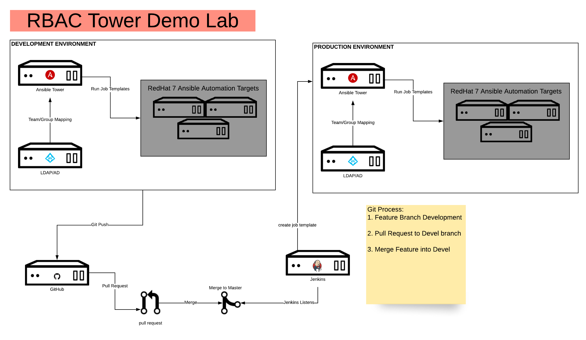

# Wells Fargo - rbac-tower-demo
Ansible playbooks to stand up an RBAC Demo using an LDAP container.



This lab will setup the following containers:

**Dev/Prod**
- 1x LDAP (LDAP Core, LDAP PhpMyAdmin)
- 1x Tower setup (RabbitMQ, Postgres, Web, Task, Memcache)
- 1x Jenkins
- 3x CentOS (Not used)

*Note: If you setup a production environment along with development, it will double the amount of containers.*


## Requirements

- The docker server >= 0.10.0
- python >= 2.6

## Getting Started

To deploy this lab on your local machine, you will need to ensure you have met all pre-requisites listed above.

**Setup Python Virtual Environment**
```bash
# Create venv
$ python3 -m venv env

# Switch into venv
$ source env/bin/activate

# Install required python packages
$ pip install -r requirements.txt
```

**Stand Up Lab**

You could modify the inventory file to point to a remote host for application deployment,
by default however, it will use localhost. (ansible_connection=local)

```bash
$ ansible-playbook -i inventory setup.yml
```

**Shutdown and Delete Lab**

This will shutdown all containers, and delete their volumes.

```bash
$ ansible-playbook -i inventory shutdown.yml
```

## Authors
- Anthony Loukinas <anthony.loukinas@redhat.com>