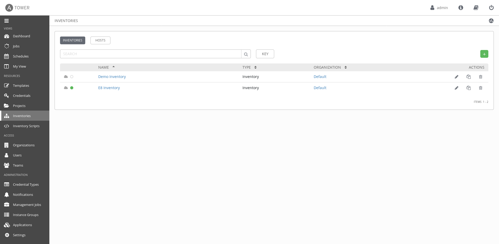
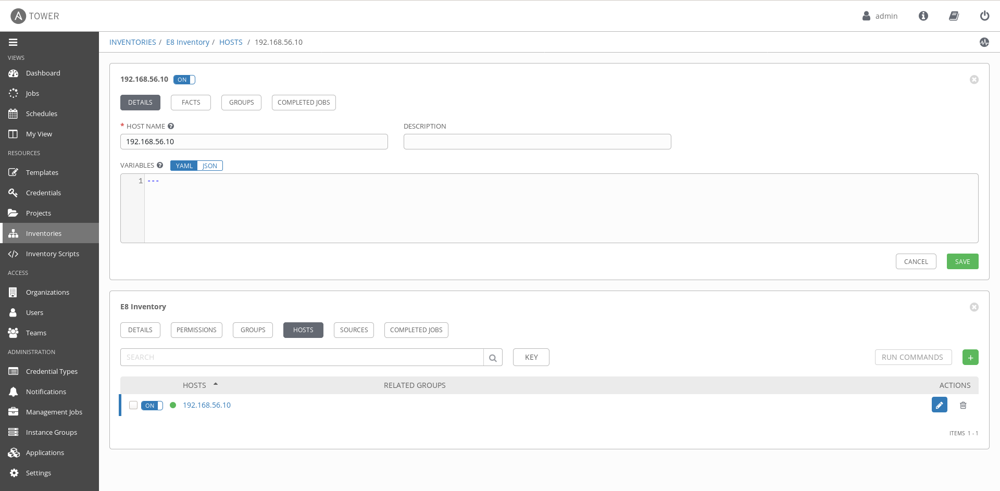
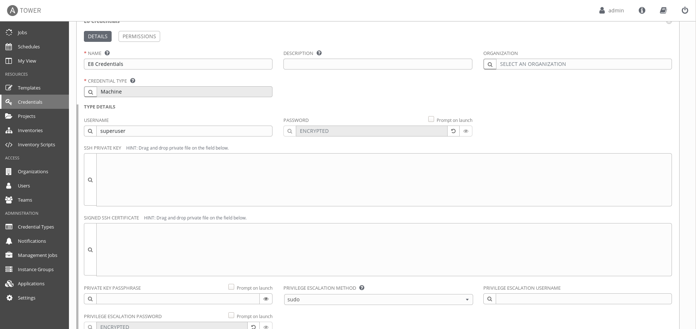
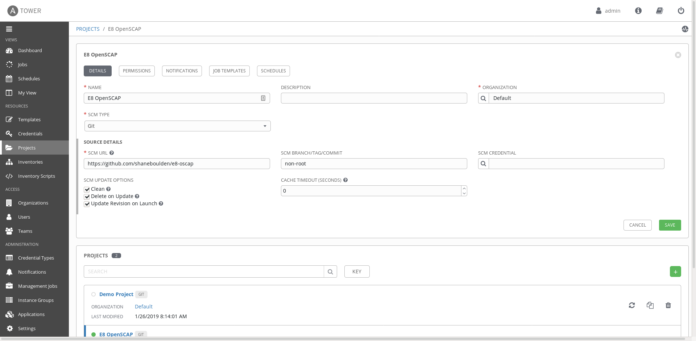

# Essential Eight RHEL+Tower demo

This repo contains artifacts used to deploy a demo of the Red Hat ANZ Tower+RHEL solution for Essential Eight compliance. It deploys a VM compromised with a basic [return-to-libc](https://en.wikipedia.org/wiki/Return-to-libc_attack) exploit, and a Tower instance that can be used to apply the custom OpenSCAP compliance content and remediate the host.

## Deploying the demo

The demo is designed to be used with Vagrant. This allows you to use the demo locally, without any potential latency overheads introduced by RHPDS. The `tower` Vagrant box requires Virtualbox, and this demo does also.

You can deploy the demo with a simple `vagrant up`.

If the demo fails to deploy, you can selcetively rebuild the server with the command `vagrant server up --provision`.

## Configuring Tower

Log into the web interface at `https://10.42.0.42` using the credentials `admin/password`

Activate the license_expires_25_July_2020.txt available in this same repository. If you prefer to use your own license, you can get a Red Hat Employee licence from https://store.ansible.com/redhat/tower_license/. Once the licence has been emailed, download and save the file, and upload to the Tower interface when prompted.

Select *Inventories* and create an inventory *E8 Inventory*. 


Select the *E8 Inventory* and select *Hosts*. Create a new host *192.168.56.10*.


Select *Credentials* and create a new set, *E8 Credentials*. Select the *Credential Type* as *Machine*.

For the user, enter `superuser`. Enter `1800redhat` for the *PASSWORD*, and for the *PRIVILEGE ESCALATION PASSWORD*. 


Select *Projects* and create a new project *E8 OpenSCAP*. Set the following:
* *Organisation*: Default
* *SCM Type*: Git
* *SCM URL*: https://github.com/shaneboulden/e8-oscap
* *SCM Update Options*:
 - Clean selected
 - Delete on Update selected
 - Update Revision on Launch selected
Select save


Select *Templates* and create a new template *E8 Remediation*. Select the following:

* *Inventory*: E8 Inventory
* *Job Type*: Run
* *Project*: E8 OpenSCAP
* *Playbook*: remediate.yml
* *Credential*: E8 Credentials
* *Options*:
 - Enable Privilege Escalation selected

## Using the demo

Once the playbook has completed successfully, you can demo the compromised using the `pleb` user. Ansible will configure the user's password to be `1800redhat`.
```
# switch to the pleb user
su - pleb
$

# check that the user can't sudo
$ sudo -i
pleb is not in the sudoers file.  This incident will be reported.

# now exploit the stack overflow and verify the user is now root
$ (cat in.txt; cat) | /usr/local/bin/exploitme
Try to exec /bin/sh
Read 128 bytes. buf is AAAAAAAAAAAAAAAAAAAAAAAAAAAAAAAAAAAAAAAAAAAAAAAAAAAAAAAAAAAAAAAAAAAAAAAAAAAAAAAAAAAAAAAAAAAA�
No shell for you :(
whoami
root

setenforce 0
getenforce
permissive
```

You can then remediate the host using the Ansible Tower *E8 Remediation* job, and verify that the exploit no longer works. 
```
[pleb@webserver ~]$ (cat in.txt; cat) | /usr/local/bin/exploitme
Try to exec /bin/sh
Read 128 bytes. buf is AAAAAAAAAAAAAAAAAAAAAAAAAAAAAAAAAAAAAAAAAAAAAAAAAAAAAAAAAAAAAAAAAAAAAAAAAAAAAAAAAAAAAAAAAAAA�
No shell for you :(
whoami
Segmentation fault
```

### Troubleshooting

#### I get a segfault when running the code

Firstly, check that ASLR is disabled. This is required for the exploit to function (creates predictable stack addresses):
```
cat /proc/sys/kernel/randomize_va_space
0
```
If this command outputs anything but 0, just set it back:
```
echo 0 > /proc/sys/kernel/randomize_va_space
```

Next, we need to check libc is at a predictable address. Fire up gdb, and find the address of the system command:
```
$ gdb /usr/local/bin/exploitme
(gdb)$ start
(gdb)$ p system
$1 = {<text variable, no debug info>} 0x7ffff7a51140 <system>
```
If this address is different than the address of system in `build_exploit.py`, update the address.

Now let's check the address of "/bin/sh". Let's install the Python Exploit Development Assistance package first:
```
git clone https://github.com/longld/peda.git ~/peda
echo "source ~/peda/peda.py" >> ~/.gdbinit
```
Fire up gdb, `start`, and let's run a find:
```
$ gdb /usr/local/bin/exploitme
gdb-peda$ start
gdb-peda$ find "/bin/sh"
Searching for '/bin/sh' in: None ranges
Found 3 results, display max 3 items:
exploitme : 0x4006fb --> 0x68732f6e69622f ('/bin/sh')
exploitme : 0x6006fb --> 0x68732f6e69622f ('/bin/sh')
     libc : 0x7ffff7b94f89 --> 0x68732f6e69622f ('/bin/sh')
```
While we could use the libc address, it's easier if we just use the '/binsh' string we've packed inside our own binary. Check that this value matches the `pointer to "/bin/sh"` line in `build_exploit.py`. 
