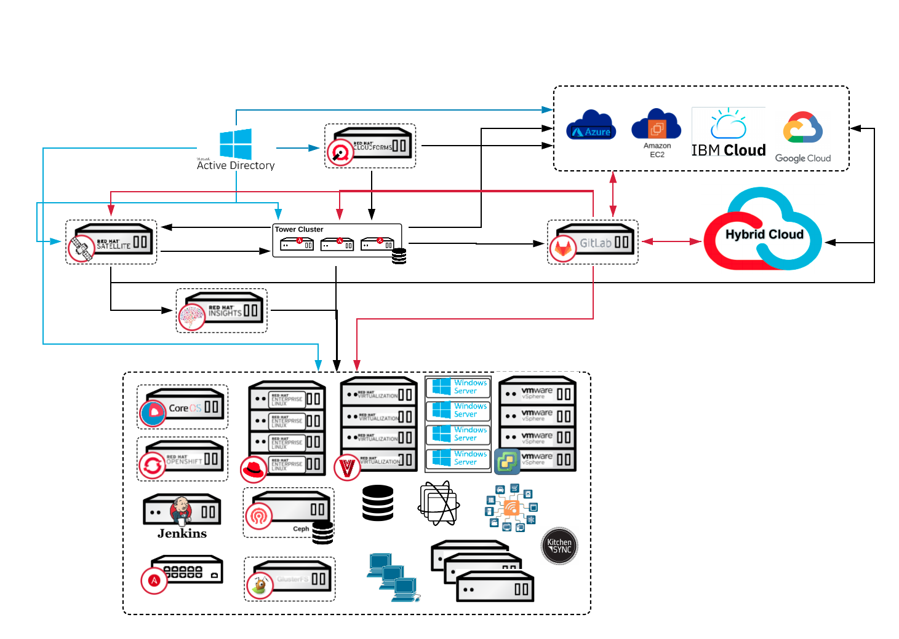
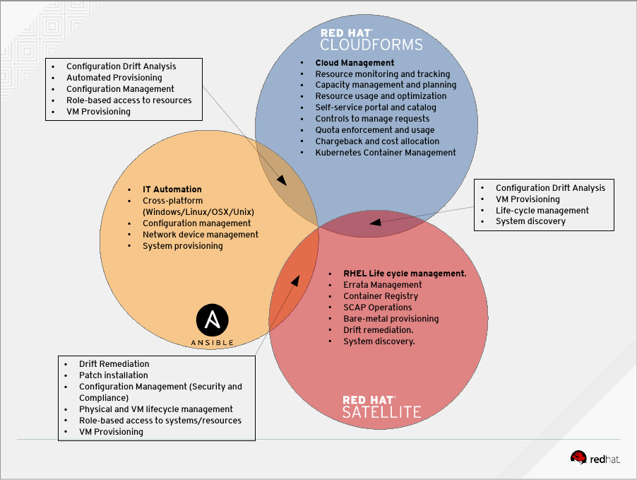
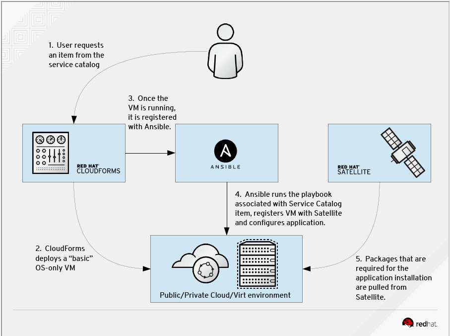
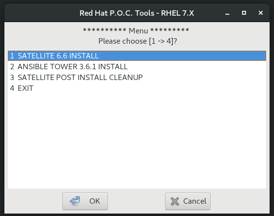

* Table of contents, below Intro for Tools and Docs

# RED HAT MANAGEMENT PORTFOLIO
In every environment there is a core set of servers/services that are required to allow your users to interface with the systems they use daily in seamless operation. The Red Hat Management Portfolio can provide you with the tools you need from a User Front End, Provisioning, Orchestration, Automation, and Management for your environment. These systems will allow you to provide that next level of IT service to your end users/customers. 

My work is focused on: 
* Ansible Tower
* Satellite
* InSights

The key to success is always in the planning! The venn diagram below depicts the primary functions between tools and the overlap between to help you decide where you would like to situate the functions, and assist in integrating the tools within your IT environment(s) 
## Satellite: 
The easiest way to manage your Red Hat infrastructure for efficient and compliant IT operations. Establish trusted content repos and processes that help you build a standards-based, secure Red Hat environment. 
## AnsibleTower: 
Simple, agentless automation platform that can improve your current processes, migrate apps for better optimization, and provide a single language for DevOps practices across your organization. Ansible Tower by Red Hat is a centralized API for your Ansible automation and a graphical user interface for Ansible.
## InSights: 
A predictive analytics tool with real-time, in-depth analysis of your Red Hat infrastructure, letting you predict and prevent problems before they occur.

Working in tandem, this is what the optimal Management system would look like from a Red Hat perspective.

## Table of Contents
* [Ansible_Tower](#Ansible_Tower)
 * Ansible_Cheat_Sheets
 * Ansible_DOC
 * Ansible_PDF
 * Ansible_PPT
 * Ansible_Use_Cases
 * Ansible_Video_Demos
 * Playbook_Examples
### Simple Scripts for installing Ansible Tower P.O.C on a single node/vm on RHEL7/8:
 ** [Request_an_Ansible_Tower_License](https://www.redhat.com/en/technologies/management/ansible/try-it?extIdCarryOver=true&sc_cid=701f2000001OH6uAAG)

 * ANSIBLE_TOWER-3.6.4-1-INSTALLER.sh
 * ANSIBLE_TOWER-3.7.0-4-INSTALLER.sh
  
* [Redhat_Workshops](#Redhat_Workshops)
 * Code for building workshops.

* [Satellite](#Satellite)
 * Satellite_PDF
 * Satellite_DOC
 * Satellite-Ansible_Playbooks
### RPM for an X enabled server (not required) 
 * xdialog-2.3.1-13.el7.centos.x86_64.rpm
### Simple script checking the health of your Satellite once it is set up on your RHEL7 sys:
 * sat6_healthCheck.sh
### Simple script for installing Satellite P.O.C on a single node/vm on RHEL7:
  ** [Request_Satellite_License](https://www.redhat.com/en/technologies/management/smart-management)

 * REDHATTOOLSINSTALLER-6.7-4.sh
  
* [Useful_Scripts](#Useful_Scripts)
