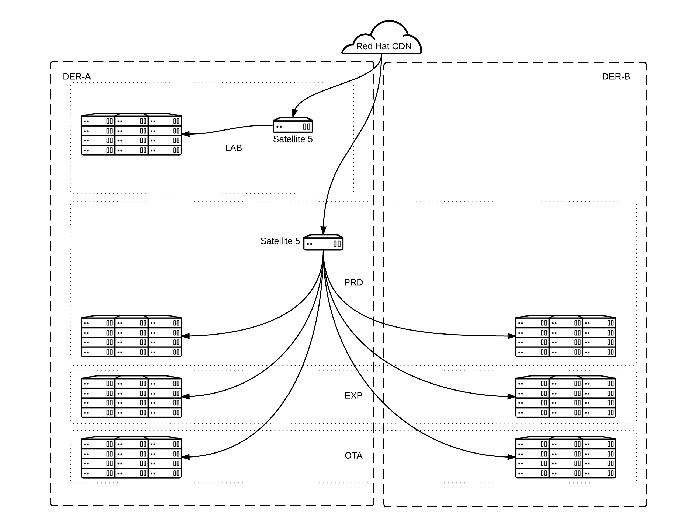
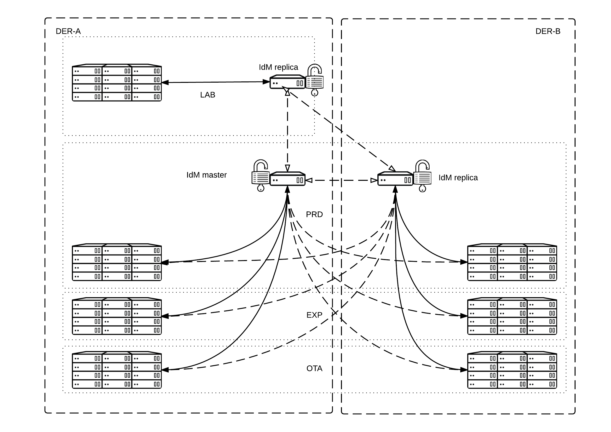

= {subject}: PREPARED FOR - {customer}
Sander Snel <sander@redhat.com>
:subject: SATELLITE AND IDM TARGET ARCHITECTURE PROJECT PLAN
:description: TARGET ARCHITECTURE AND PROJECT PLAN
:doctype: book
:confidentiality: Confidential
:customer:  DUO
:listing-caption: Listing
:toc:
:toclevels: 6
:sectnums:
:chapter-label:
:icons: font
ifdef::backend-pdf[]
:pdf-page-size: A4
:title-page-background-image: image:images/EngagementJournalCoverPageLogoNew.jpg[pdfwidth=8.0in,align=center]
:source-highlighter: rouge
:rouge-style: github
endif::[]
:revnumber: 0.1

//A simple http://asciidoc.org[AsciiDoc] document.

== History and Revisions

[cols=4,cols="1,3,3,4",options=header]
|===
|Version
|Date
|Authors
|Changes

|0.1
|6.03.2017
|Sander Snel sander@redhat.com
|Initial Draft

|===

== EXECUTIVE SUMMARY

DUO  currently has 2 data centers in Groningen.
The current IT landscape of DUO  consists of a multitude of in-house written applications, technology and implementations of both closed and open source technology.
Because of the status as a governmental organisation, security compliance is a key factor in every design, starting with security in the designs from day one.
As the insights in IT are constantly evolving, technology is also changing, leaving the current application infrastructure outdated.
Insights within DUO  are also changing, leading to different choices of IT vendors and components.
To update the infrastructure to the technology and internal vision of today, a renewal plan is written.
This document outlines the details of the renewal plan that is created together with Red Hat sales, architecture and consulting.
It describes the architecture of the new platform, the decisions made and guides the implementation teams through the delivery of all the separate components that make up the renewal plan.
The renewal plan, carried out together with Red Hat, will help with:

* Modernization and standardization of the Linux operating system deployments
* Implementation of full-stack automation integrated within the management platform
* Aligning internal security procedures with technology best practices for central authentication, authorization and security hardening
* Easing the workload on system engineers by standardizing and simplifying the way of working for Linux operating system deployments

After completion of the renewal plan, DUO  will have a application delivery platform based on the latest internal requirements and many of the industry of today’s best practices regarding Linux operating system delivery.
Doing so, will ease the way to further optimization, using technology such as containerization;
A lightweight alternative to full machine virtualization that involves encapsulating an application together with all its dependencies in a container with its own operating environment.

== PREFACE

=== Confidentiality, Copyright, and Disclaimer
This is a Customer-facing document between Red Hat, Inc. and DUO  (“Client”).
Copyright © 2017 Red Hat, Inc. All Rights Reserved. No part of the work covered by the copyright herein may be reproduced or used in any form or by any means – graphic, electronic, or mechanical, including photocopying, recording, taping, or information storage and retrieval systems – without permission in writing from Red Hat except as is required to share this information as provided with the aforementioned confidential parties.
This document is not a quote and does not include any binding commitments by Red Hat.
If acceptable, a formal quote can be issued upon request, which will include the scope of work, cost, and any customer requirements as necessary.

=== About This Document
This document describes the target architecture for the implementation and migration of Satellite and IdM as the new target platform for the client.

=== Audience
This document is provided for use by system engineers, architects and other stakeholders at the project.

=== Additional Background and Related Documents
This document is built upon the DUO current archictecture, with Disaster Recovery in mind.

== Stakeholders

.Staffing Table
[cols=3,options=header]
|===
<|Name <|Role <|Contact details
|Wouter Kerdijk
|Product Owner CD team
|wouter.kerdijk@duo.nl

|Jasper Spaans
|Scrum Master CD Team
|jasper.spaans@duo.nl

|Roel Jonkman
|Scrum Master CD Team
|roel.jonkman@duo.nl

|German Pizarro
|Red Hat consultant
|gpizarro@redhat.com

|Sander Snel
|Red Hat consultant
|sander@redhat.com
|===

== CURRENT ENVIRONMENT AND CHALLENGES

=== Red Hat Infrastructure
The DUO Infrastructure currently consists of the following Red Hat products that are need to be either upgraded or redesigned to be more resilient and take the load of the engineers in terms of ease of use and automation.

=== RPM management
RPM packages are cloned every day and updating systems takes place in a 1-month update cycle. For incidental security patches, a separate procedure is not in place. Patches are usually not applied earlier than in a 1- month cycle.

=== Deployment
After the initial manual deployment, consecutive updates and configuration management are carried out by using Puppet.

== HIGH LEVEL OVERVIEW OF THE GOAL

=== Target architecture Satellite

=== Target architecture IdM

=== Per-zone Infrastructure
Infrastructure is segmented using the following three key differentiations:
* *Location* Geographical location where a data center is located Deployment (DER-A + DER-B)
* *Stage* (LAB, EXP, OTA, PRD) Network in one location, hosting one stage
* *Zone* Per-zone Infrastructure (LAB, PRD)

As every zone needs to have several core services for it to operate correctly, every zone is fitted with a set of resources.
Those resources are meant to be used only by hosts within that zone.
The services are updated and managed through a connection with the central Services network, independent of the zone it is configured in.
When scaling out to a different location and therefore creating a new network zone, a new set of core services also needs to be deployed in that zone.
For multiple zones within the same stage, usually when spanning multiple locations,, a replica set of services can be used.
By doing so, authentication information will be shared within the whole stage, instead of being segmented to only one zone.

== ENVIRONMENT CONSIDERATIONS

=== Housing and location

==== Multiple data centers
The servers are operated in 2 locations in Groningen, with a future expansion to the ODCN datacenter.
All servers are virtual.

== Virtualization

=== Technology
Servers are virtualized on VMware vSphere. The VMware platform does span over 2 geographical locations.

== DESIGN CONSIDERATIONS

=== Security

==== CIS
The Center for Internet Security (CIS) mobilizes a broad community of stakeholders to contribute their knowledge, experience and expertise to identify, validate, promote and sustain the adoption of cybersecurity's best practices.
These best practices are then condensed in to many different CIS benchmarks. Benchmarks provide guidance, background and implementation details around the hardening of systems according to the best practices developed by CIS.
All systems that are configured, need to be hardened using these standards. The standards for Red Hat Enterprise Linux 7 are approved by the internal Security department and are based on the BIR Compliancy Guidelines.

==== User replication from Active Directory
Microsoft Active Directory is a database that keeps track of all the user accounts and passwords in an organization. It allows it to store your user accounts and passwords in one protected location, improving the organization's security. Active Directory is subdivided into one or more domains.
Users are stored in Active Directory domains and Active Directory is considered to be the single source of truth for user account management. Users created in Active Directory need to be synchronized to their corresponding network environment. Passwords will also be synchronized.

==== Desired state enforcement for security baseline
The security baseline needs to be constantly checked. Any changes on a local system that confiict with the security baseline automatically need to be restored to their secure defaults and a warning should be sent out. Every system in the environment running Red Hat Enterprise Linux will have the CI Security RHEL baseline using a client-written CIS Puppet 4 module applied. Due to constraints of the Satellite system with regards to compatibility with the client-written CIS modules, this will be done later when Satellite supports Puppet 4 and this will not be set up initially.

==== Secure connections
Transport Layer Security (TLS) and its predecessor, Secure Sockets Layer (SSL), both frequently referred to as "SSL", are cryptographic protocols that provide communications security over a computer network. Web applications use TLS to secure all communications between their servers and web browsers.
Any connection from the components of the “Per-zone Infrastructure” to the outside world and in the zone itself need to be secured using at least TLS 1.2.

==== Official packages
Packages on a Red Hat Enterprise Linux server can have many origins.
They can be downloaded from the public internet, created or downloaded from Red Hat.
Only official Red Hat packages, verified packages from the internet and self-created packages will be used.
No other ways of downloading and rolling out packages to a system will be available, to make sure only official, verified software is running. Packages should be signed and no unsigned or unknown origin packages will be placed on the server.

=== Other

==== Disposable infrastructure
Treating infrastructure as disposable means accepting configuration drift as a possibility and then concentrating on making sure a machine can easily be rebuilt from scratch when it is needed.
This is a more traditional way of using configuration management, compared to using immutable infrastructure, where the perception is that mutable state is a common source of defects in computer programs and the use of immutable objects can result in much simpler code with less defects.
Accepting state is usually a lot easier than eliminating state. Having the elements in place to make sure that infrastructure can be recreated, the same end result can be achieved: an reproducible infrastructure that is created from code and only from code.
For example, in the case of small, infrastructure-wide configuration changes, an immutable approach would require an operator to destroy and rebuild the entire infrastructure.
On the other hand, a disposable approach means an operator can simply update the configuration management code and let the change slowly roll out on its own. Treating the infrastructure as disposable means an operator is never forced to destroy and rebuild machines if he does not want to, but can still do it any time he needs to.

==== Updates and versions
All new systems will be installed with the same version of Red Hat Enterprise Linux 7. Versions will not differ between machines in the same stage.
Updates will be installed as soon as possible, according to the current update procedures.

==== Failure resistant
When any of the zones fail, including the Services zone, system management should still be able to continue in all of the other network zones.
Therefore, components need to be configured to work without their central counterpart and be tested accordingly.

=== Central components
The central components are only created once. They are all hosted in the services network.

==== Active Directory
A directory, in the most generic sense, is a comprehensive listing of objects. A phone book is a type of directory that stores information about people, businesses, and government organizations.
Phone books typically record names, addresses, and phone numbers. Active Directory is similar to a phone book in several ways, and it is far more  exible.
Active Directory will store information about organizations, sites, systems, users, shares, and just about any other network object that you can imagine. Not all objects are as similar to each other as those stored in the phone book, so Active Directory includes the ability to record different types of information about different objects. At the client, these Active Directory servers are used for the management of Windows servers.
The client provides an Active Directory environment per zone. The user accounts of this Active Directory are then replicated to the corresponding IdM servers for access to the Red Hat Enterprise Linux servers.

==== Red Hat Satellite
Satellite is an on-premise alternative to trying to download all of content from the Red Hat content delivery network or managing your subscriptions through the Customer Portal.
From a performance side, it reduces hits to the network bandwidth because local systems can download everything they need locally; from a security side, it can limit the risks of malicious content or access, even enabling entirely disconnected environments.
Satellite is composed of a centralized Satellite Server.
Depending on your data center setup, organization design, and geographic locations, you can have local Capsule Servers, which are proxies that locally manage content and obtain subscription, registration, and content from the central Satellite Server.

=== Per-zone Infrastructure components
These components are rolled out in each of the zones. They are created in every zone to make sure that a failure in one location, cannot impact management or operations in any of the other zones.

==== IdM Master
Identity Management in Red Hat Enterprise Linux is designed and integrated into Red Hat Enterprise Linux for versions 6.2 and later, to simplify identity management.
This feature set is available free with your Red Hat Enterprise Linux subscription. IdM Increases compliance levels by implementing identity and access management and hosts the following components.

*Central Authentication Management*

Provides a centralized and clear method for managing:

* Identities for users, machines, and services within large Linux/Unix enterprise environments
* Security mechanisms

*Integrated Public Key Infrastructure (PKI) Service*

Provides:

* PKI services that sign and publish Certificates for hosts and services
* Certificate Revocation List (CRL) and OCSP services for software validating the published certificate

*Fine-grained Access Control*

Lets you define access control policies to govern user identities. The administrator can also delegate selected administrative tasks to other power users to create a clear and simple separation of responsibilities.

*Active Directory Cross-Realm Trust and Direct Connect to Active Directory*

Lets administrators establish cross-forest Kerberos trusts with Microsoft Active Directory.
This allows external Active Directory (AD) users convenient access to resources in the Identity Management domain.
The IdM master receives a data set from Active Directory. That data set contains users, passwords and other relevant user information.
The IdM master then provides LDAP and Kerberos authentication and authorization services to the servers within the zone.

==== IdM Replica
In case the IdM master fails or needs to be upgraded, the replica IdM server will take over.
The data set on this replica is read-write and changes done there will be synced back as soon as the master IdM gets back online.
Also, in some zones there is no IdM master, for example because they share the same accounts within the whole stage.

==== Satellite Capsule
The Satellite capsule is a selective mirror from the central Satellite server. It contains all necessary packages, kickstarts and other configuration to install and configure systems in the zone.
Because installations are usually quite bulky (more than one GiB), this also prevents large amounts of data being transferred between multiple geographic locations.

== PLANNING OVERVIEW
Before any of the work is done, the requirements need to be  filled. The requirements chapter contains all requirements that need to be  filled before starting with the actual implementation.

.Requirements Table
[cols=2,cols="1,5"]
|===
|REQ-1
|Virtual machines for the environment

|REQ-2
|Software subscriptions

|REQ-3
|Sub-CA certificate

|REQ-4
|Firewall reconfiguration

|REQ-5
|Active Directory

|REQ-6
|DNS access

|REQ-7
|Versioning server

|REQ-8
|Documentation server

|REQ-9
|User accounts

|REQ-10
|Staff availability

|REQ-11
|Firewall ports
|===

The project is then composed of four different, partial implementations, together implementing the whole plan.
The partial projects are then split up again in separate deliveries, together forming the whole implementation of the partial project.

A definition of done is provided that every partial implementation needs to match before considering that part completed.

.Definition of Done Table
[cols=2,cols="1,5"]
|===
|DOD-1
|Implemented in all environments, up until production

|DOD-2
|Compliant with architecture and design considerations

|DOD-3
|Demonstrated to the stakeholders

|DOD-4
|Documented on a technical level

|DOD-5
|Monitoring using the client monitoring platform

|DOD-6
|Code committed to the versioning server
|===

*Implement Red Hat Satellite*

For the implementation of Red Hat Satellite and Red Hat Identity Management full time support from Red Hat is available.
The following partials, split up between Satellite and IdM will be delivered.

.Satellite Deliverables Table
[cols=2,cols="2,5"]
|===
|DLV-SAT-1
|Design requirements for Satellite, update DTO

|DLV-SAT-2
|Updated image for joining Satellite

|DLV-SAT-3
|Playbook or Manifest installation for Satellite according to documented requirements

|DLV-SAT-4
|Test report and documentation for Microsoft Systems Center Orchestrator integration

|DLV-SAT-5
|Test report and documentation for Provisioning GUI integration

|DLV-SAT-6
|Playbook or Manifest installation for Capsules according to documented requirements

|DLV-SAT-7
|Documentation and demonstration

|DLV-SAT-8
|Scale to all zones

|DLV-SAT-9
|Migrate all RHEL machines to new Satellite

|DLV-SAT-10
|Implement patch procedures
|===

*Implement Red Hat Identity Management*

.IdM Deliverables Table
[cols=2,cols="2,5"]
|===
|DLV-IDM-1
|Playbook / Manifest installation IdM Master

|DLV-IDM-2
|Active Directory connection

|DLV-IDM-3
|Playbook / Manifest installation IdM Slave

|DLV-IDM-4
|Documentation, demonstrate Playbook / Manifest

|DLV-IDM-5
|Test Backup and Restore procedure

|DLV-IDM-6
|Test report and Documentation of failover

|DLV-IDM-7
|Scale to all stages

|DLV-IDM-8
|Migrate all RHEL machines to new IdM
|===

*Puppet Migration*

.Puppet Deliverables Table
[cols=2,cols="2,5"]
|===
|DLV-MIG-1
|Integrate current Puppet workflow in Satellite

|DLV-MIG-2
|Application migration test report and documentation

|DLV-MIG-3
|Life cycles for the migrated application

|DLV-MIG-4
|Demo for the working life cycle managed application

|DLV-MIG-5
|Add remaining puppet code to Satellite
|===

== PREREQUISITES
Before starting with the implementation, several items need to be delivered by the client. These consist of:

=== Virtual machines

*REQ-1:* A total of 9 VM’s is needed for the environment.
Many of these can be auto created when the Satellite environment is set up, but capacity needs to be available to allocate these VM’s.
The VM’s highlighted in bold should be created beforehand.

.Machine Types Table
[cols=2,cols="2,5",options=header]
|===
|Machine Type
|Zones

|IdM Master
|DER-A-PRD, DER-A-LAB (sandbox)

|IdM Replica
|DER-B-PRD, DER-A-LAB, DER-A-LAB (sandbox)

|Satellite Server
|DER-A-PRD, DER-A-LAB (sandbox)

|Capsule Server
|DER-B-PRD, DER-A-LAB
|===

=== Subscriptions
*REQ-2:* All subscriptions for Red Hat Enterprise Linux, Satellite and Ansible Tower need to be in place. The client will provide the credentials of a RHN account having access to these subscriptions.

=== Sub-CA certificates
*REQ-3:* IdM also acts as a certificate provider. For certificates to be trusted by the root CA that is available internally, a sub-CA certificate needs to be provided, together with the private key of this certificate.
These certificates should have the CA:TRUE flag set and have an expiry date of at least 10 years from the creation date. One of these certificate/key pairs should be provided per stage.

=== Firewall reconfiguration
*REQ-4:* During the project, the implementation team should be able to open any port in any of the firewalls without considerable delay,
provided that there is a reason that this specific port needs to be opened during the implementation of a product.

=== Active Directory
*REQ-5:* For each of the stages, an Active Directory environment containing at least 3 users should be available in the services zone.
The Administrator credentials of the domain need to be provided and support at the client side with Active Directory needs to be available throughout the engagement.

=== DNS access
*REQ-6:* The implementation team needs to be able to make DNS registrations for hostnames and other required components in the central DNS infrastructure.

=== Versioning
*REQ-7:* A versioning system needs to be provided to store Automation (Playbooks,Manifests) code and scripts.

=== Documentation
*REQ-8:* A wiki system needs to be provided for documentation.

=== Useraccounts
*REQ-9:* Red Hat staff should have access to the office, Linux environment, internet, documentation and versioning systems using their own user account.

=== Staff availability
*REQ-10:* The client needs to make the people from their side available to work with Red Hat engineers.

=== Initial firewallports
*REQ-11:* To start out, the ports from Appendix A need to be opened on the firewall.

== DEFINITION OF DONE FOR A IMPLEMENTATION
The following chapter outlines the requirements for any of the implement phases of the project. To complete a whole implement phase, all DoD items will need to be checked off.
Completing all deliverables, numbered with a DLV number, within an implementation, should mean that all DoD items can be checked off for this implementation.

*DOD-1:* Every per-zone component is implemented in the following zones:

** DER-A-LAB (sandbox)
** DER-A-LAB
** DER-B-PRD

*DOD-2:* Every component fully complies with the design considerations

*DOD-3:* Every component is demonstrated to the stakeholders when it is ready

*DOD-4:* Every component is documented on a technical level

*DOD-5:* Monitoring is in place for the component using the currently existing Zabbix monitoring platform

*DOD-6:* Any of the code created during the implementation of the component, including Ansible playbooks or Puppet manifests, is committed to the internal versioning system.

== IMPLEMENT: RED HAT SATELLITE

=== About

==== Red Hat Consulting involvement

Red Hat will provide support and guidance to the engineers of the client and assist with the implementation.
Red Hat will train the engineers on the job and assist them to make sure the deliveries match the architecture plans.
Red Hat will avoid to create any deliveries by themselves without involvement of the client team.

=== Implementation details

==== Satellite in PRD Zone

The Red Hat Satellite server will be implemented as a single instance in the PRD network.
This single instance will then be configured according to the requirements of the client, that need to be captured and consists of:

* Design of life cycle management, like life cycle paths, content views, composite content views,  filters, errata management and host collections.
* Design of a host group for one customer application
* Design of a backup and recovery plan using the TSM backup software

*DLV-SAT-1:* The design requirements are captured and documented in the documentation system
Next, a simple Satellite server Ansible playbook or Puppet Manifest is delivered that installs Satellite and makes sure it:

* Aligns with the architectural design
* Retrieves content from the Red Hat CDN and saves it using the lazy_sync option
* Aligns with the goals of a disposable infrastructure
* Implements the captured requirements for life cycle management and hostgroups
* Implements the backup plan
* Runs Puppet 3
* Integrates with InfoBlox for IP management (through an API or manual process, registering hosts in the lin.xxx.duo.nl and lin.duo.lab domain)
* Is configured for one organization
* Hosts content for RHEL 7, including any custom rpm packages that the client delivers at the start of the deliverable
* Satellite is being monitored by Zabbix
* Satellite logs are forwarded to ELK / Kibana

*DLV-SAT-2:* The Red Hat Enterprise Linux kickstart installations are updated to automatically join Satellite at their first start up and the VMDK images are connected to the ESX template.

* The VM starts with a kickstart template and connects to the DUO puppet infrastructure
* The VM registers itself in Satellite based on the activation key, and gets the correct hostgroup applied

*DLV-SAT-3:* The final playbook installing Satellite according to the requirements outlined, test report and documentation of the solution are delivered by the implementation team and stored in the versioning system.
Now that the basic roll-out is working, Satellite will be further configured to:

* Connect to the vSphere environments for subscription management from Satellite

*DLV-SAT-4:* VM's are provisioned through SCO, this system needs to have a new set of runbooks which connect to Satellite.

* Create new runbook structure in SCO
* Create or modify existing runbooks to integrate with Satellite
* test to provision a new VM through SCO
* document the new functionality

*DLV-SAT-5:* Provisioning GUI integration needs to be implemented, so that the new set of runbooks are utilized

* create new templates for PROVGUI
* test to provision a new VM through PROVGUI
* test to provision a new silo through PROVGUI
* document the new functionality

==== Satellite capsules in the zones
For the setup of the Satellite capsule in each of the network zones, simple Ansible playbook / Puppet manifest is created to setup the Satellite capsule that:

* Connects with the Satellite server in the PRD zone
* Retrieves content from the Satellite server and saves it using the lazy_sync option
* Allows new machines to be registered to itself, without a connection to the central Satellite server
* Has the ability to store log files to the central log server in the zone

The playbook is ran against newly created VM's that will host the capsule in all of the zones,
creating the capsule and joining it to Satellite.

*DLV-SAT-6:* The final playbook installing one Satellite Capsule according to the requirements outlined, test report and documentation of the solution are delivered by the implementation team and stored in the versioning system.

*DLV-SAT-7:* When the setup works in one zone, the documentation is updated, verified and the API interfaces are explained to the team. The created playbook is then committed to the versioning system.

*DLV-SAT-8:* To finish up the installation, the capsules are then created in all the other zones using the same Ansible playbook. Any required alterations are also updated in the playbook and documentation.

*DLV-SAT-9:* To further help with the connection of existing systems to Satellite, all systems are migrated to connect to Satellite 6 through the capsules and the connection steps are documented.

* create puppet manifest to disconnect from Satellite5 and register at Satellite6

*DLV-SAT-10:* implementation of patch schedule to ensure easy patch management

* Create schedule based on host groups, so smaller subsets can be updated
* Create a fast lane for security errata so they can be deployed without installing software updates and bug-fixes

== IMPLEMENT: RED HAT IDM
=== About
==== Red Hat Consulting involvement
Red Hat will provide support and guidance to the engineers of the client and assist with the implementation.
Red Hat will train the engineers on the job and assist them to make sure the deliveries match the architecture plans.
Red Hat will avoid to create any deliveries by themselves without involvement of the client team.

==== Implementation details
Red Hat IdM will be implemented using a Puppet manifest. The manifest should make sure to:

* Use the Satellite infrastructure as configured by the Satellite implementation
* (Optionally) Install Red Hat IdM as a master
* Install a second Red Hat IdM as a replica from a master IdM
* Configure IdM as a sub-CA using the certificate provided by the client
* Send all logfiles to the logging aggregator
* provide checks so that the VM is being monitored by Zabbix

Next, to further fine tune the implementation, the following tasks need to be carried out:

* Implement Satellite authentication so users logging in to Satellite are authenticated using their IdM user
* Implement a basic user, group, sudo and HBAC policy
* Migrate the current IdM schemas
* Migrate the AD sync script or if approved by Security and IOS, set up a domain trust

Now, a test is conducted by:
* Installing a new VM in the PRD network
* Verify whether a newly created user in IdM can log in to the system successfully.

*DLV-IDM-1:* Now, the  final manifest installing Red Hat IdM according to the requirements outlined,
test report and documentation of the solution are delivered by the implementation team and stored in the versioning system.
After basic operation is verified, continue by connecting IdM to Active Directory using the credentials supplied by the client.
Then, test the setup by:

* Logging in as that user on a machine in the services network using the Windows-assigned password
* Disable the master IdM, flush all caches and repeat the log in

*DLV-IDM-2:* The test report of the connection to Active Directory will now be delivered by the implementation team.

*DLV-IDM-3:* To finish the implementation, update the documentation and commit the manifests to a versioning system.

*DLV-IDM-4:* Now, scale the environment by running the playbook in each one of the zones,
where any zone within the same stage will not get an IdM Master, but only a replica, as outlined in the design.

== IMPLEMENT: PUPPET MIGRATION
=== About
==== Red Hat Consulting involvement
Red Hat will provide support and guidance to the engineers of the client and assist with the implementation.
Red Hat will train the engineers on the job and assist them to make sure the deliveries match the architecture plans.
Red Hat will avoid to create any deliveries by themselves without involvement of the client team.

==== Implementation details
Puppet code will be migrated to the Puppet Service which is part of Satellite. It will consist of the following:

* Integrate the current DUO workflow into Satellite, including GCR code reviews
* Adding the manifests into products, which can be assigned to host groups
* Utilizing life cycle management for products

This will be tested by conducting:

* Installing a VM with a specific puppet service through the PROVGUI
* Verify if the correct puppet manifest has been applied

*DLV-MIG-1:* Integrate current Puppet workflow in Satellite

* GCR review system needs to be used
* life cycle versioning is added in Satellite, no need for git branches

*DLV-MIG-2:* A single application migration needs to be tested reported and documented

*DLV-MIG-3:* Create life cycles for the migrated application, this will create the separation between the stages

*DLV-MIG-4:* Demo the working life cycle managed application

*DLV-MIG-5:* Scale by adding all puppet manifests to Satellite, and standardizing on versioning
