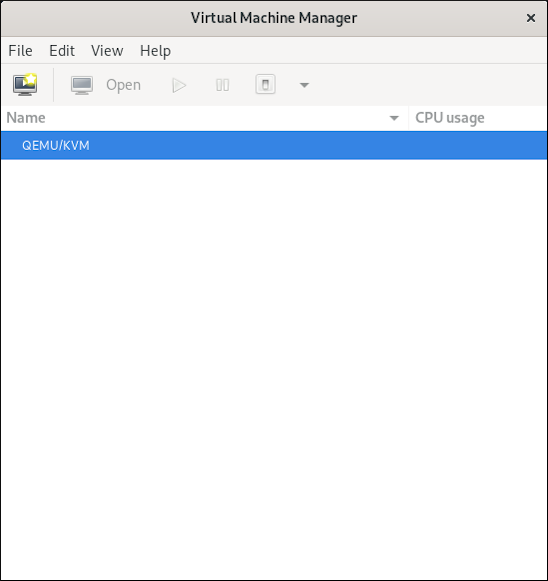
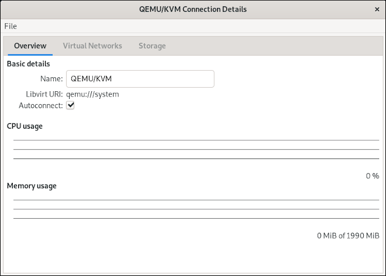
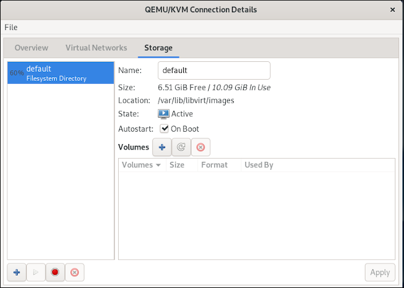
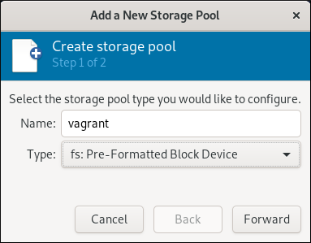
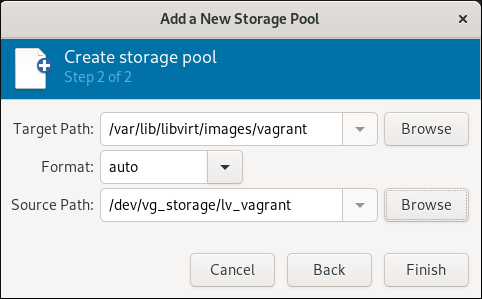
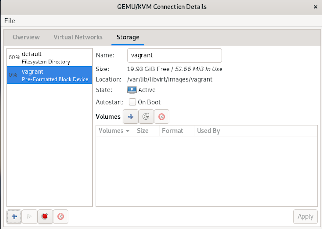

# Creating a Storage Pool

With the install of libvirt it creates a storage pool named **default** with the
path of */var/lib/libvirt/images* if you have plenty of space in that location
then you don't need to modify anything in the *Vagrantfile*. You can check how
much storage you have in the **default** pool with the following command.

```terminal
# virsh pool-info default
Name:           default
UUID:           5a170bf6-4d08-45b1-a1e3-d95aa9d8f27d
State:          running
Persistent:     yes
Autostart:      yes
Capacity:       48.97 GiB
Allocation:     26.80 GiB
Available:      22.17 GiB
```

If you would like to have more space you can either grow the partition that the
**default** pool resides on, most likely */var*. Or you can create a new pool.
We will use `virt-manager` to create the new storage pool that will be named
**vagrant**. If you don't have `virt-manager` installed, you can install it
before continuing.

```terminal
sudo yum install -y virt-manager
```

You can also enable the following configuration, which will prevent
`virt-manager` for requesting your password every time it launches.

```terminal
$ sudo su -
# cat > /etc/polkit-1/rules.d/80-libvirt-manage.rules << "EOF"
polkit.addRule(function(action, subject) {
  if (action.id == "org.libvirt.unix.manage"
    && subject.local && subject.active
    && subject.isInGroup("wheel")) {
    return polkit.Result.YES;
  }
});
EOF
```

This of course expects that your user is a member of the *wheel* group. Now you
need a storage location. I won't walk you through how to create storage but you
should have a filesystem prepared to be a storage pool.

> **Note:** The `vagrant-libvirt` plugin can't have a volume group as a storage
pool, it can only create file storage.

First you need to launch `virt-manager`.



Next double-click on the QEMU/KVM line in the window, that will open up the
Connection Details.



Click on the **Storage** tab.



Click on the '+' on the bottom left corner to add a new storage pool. Give your
storage pool a name and select *fs: Pre-Formatted Block Device*.



The *Target Path* will be auto-populated for you, put in the location of your
storage in the *Source Path*.



Click *Finish* and your new storage pool is now available to be used.



You can confirm you new storage pool is availble.

```terminal
# virsh pool-list
 Name      State    Autostart
-------------------------------
 default   active   yes
 vagrant   active   yes
```

You can also verify the size of the storage pool.

```terminal
# virsh pool-info vagrant
Name:           vagrant
UUID:           a34a3b5a-ab3d-4db3-b02f-14b672b2650d
State:          running
Persistent:     yes
Autostart:      yes
Capacity:       99.95 GiB
Allocation:     1.56 GiB
Available:      98.39 GiB
```

The last step is just to modify the *Vagrantfile* to use your new storage pool.

```ruby
libvirt.storage_pool_name = "vagrant"
```
